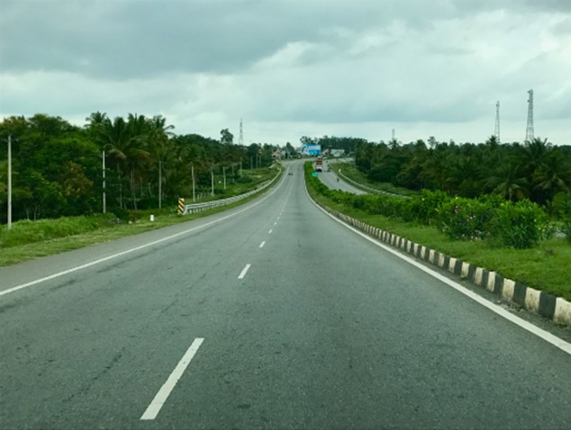
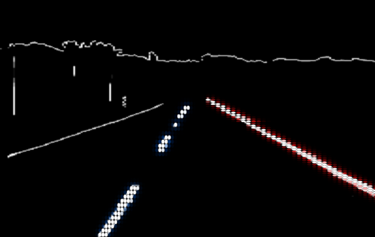
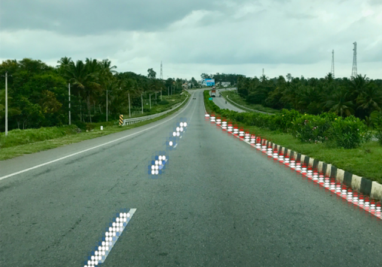

# Road lanes detection system with crash prediction network for advanced driving assistance using neural networks and computer vision

To recognize and designate lane lines on a road, this project employs Canny Edge Detection, Hough Transforms, and linear regression.


This repo was developed with the intention of making it simple to grasp for anyone unfamiliar with the project.






## How it works
We can explain this procedure in simple terms.

- Detect the lane lines by inspecting the image's colour contrast gradients; - fit a curve to the points that form the line; and - create the red lines on top of the lane lines.

- This is a lane detection technique that employs Canny Edge detection using transformations and polynomial regression to discover the edges of lines.

There are a few techniques for deciding how to draw the lines, the most recent of which is regression.


###  1. Simple Extremum

The initial method was to simply gather all of the points in the lane, identify the topmost left and rightmost points, then graph lines connecting them. This functioned rather well, although it lacked the capacity to "fill in" when there were no lane markers.

```python
    # Line Extremum Approach
    right_lines = np.array(list(filter(lambda x: x[0] > (img.shape[1]/2), lines)))
    max_right_x, max_right_y = right_lines.max(axis=0)
    min_right_x, min_right_y = right_lines.min(axis=0)
```


### 2. Average Slope 

Another, more robust, and theoretically sound method would be to forecast the x coordinates based on the average slope and solve for it with the average slope and average y and y intercept.

```python
    # Average slope Approach
    avg_right_slope = right_slopes.mean()

    # average point
    avg_right_point = np.mean(right_lines, axis=0)

    # y intercept of right line
    # b = y - mx
    right_y_intercept = avg_right_point[1] - avg_right_slope * avg_right_point[0]

    # Calculate x values based on average slope and y intercept
    max_right_x = int((min_right_y - right_y_intercept)/avg_right_slope)
    min_right_x = int((max_right_y - right_y_intercept)/avg_right_slope)
    
    r1 = (min_right_x, min_right_y)
    r2 = (max_right_x, img.shape[0]) # ground to bottom of image
```

This however would get thrown off by outliers returned by the Hough transform. 


### 3. Curve fitting

This felt like the most robust technique to connect the dots, and it's the one I'm using in my submission, by using numpy to construct a polynomial curve that modelled each lane. I'm probably the most pleased with the results for this one since it allows us to produce logical x values to complete the lanes when the road has dashed lines.

```python
    # Curve fitting approach
    # calculate polynomial fit for the points in right lane
    right_curve = np.poly1d(np.polyfit(right_lines[:,1], right_lines[:,0], 2))
    left_curve  = np.poly1d(np.polyfit(left_lines[:,1], left_lines[:,0], 2))

    # use new curve function f(y) to calculate x values
    max_right_x = int(right_curve(img.shape[0]))
    min_left_x = int(left_curve(img.shape[0]))
```


### Requirements 
- numpy
- matplotlib
- opencv
- python3 


## Authors

- [@Atharva21-stack](https://www.github.com/atharva21-stack)
